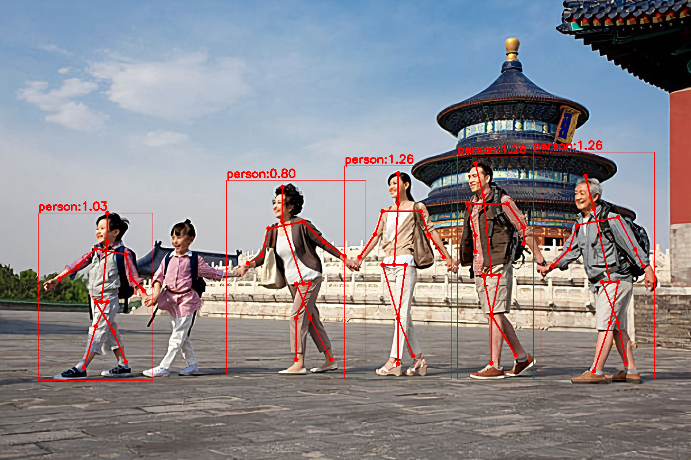

#### 2D Hand Pose Estimation 

#### 1. 编译相关依赖文件
* tflite
* opencv
* flatbuffers

#### 2. 人体检测模型
人体检测模型采用nanodetplus模型：输入图片格式为RGB, 模型输入大小[1, 288, 512, 3], 模型输出大小[1, 3064, 33]。

#### 3. 人体姿态模型
姿态的推理采用mobilenet v2模型：输入图片格式为BGR, 模型输入大小[1, 3, 224, 224], 模型的输出大小[1, 14, 28, 28]。

* 注意tflite进行推理时，先将图片的通道顺序NHWC更换为NCHW
* 模型出的14张heatmap图，最高响应的点对应的索引为关键点坐标

#### 4. 输出结果

|          原图           |           结果            |
|:---------------------:|:-----------------------:|
|  |  |

