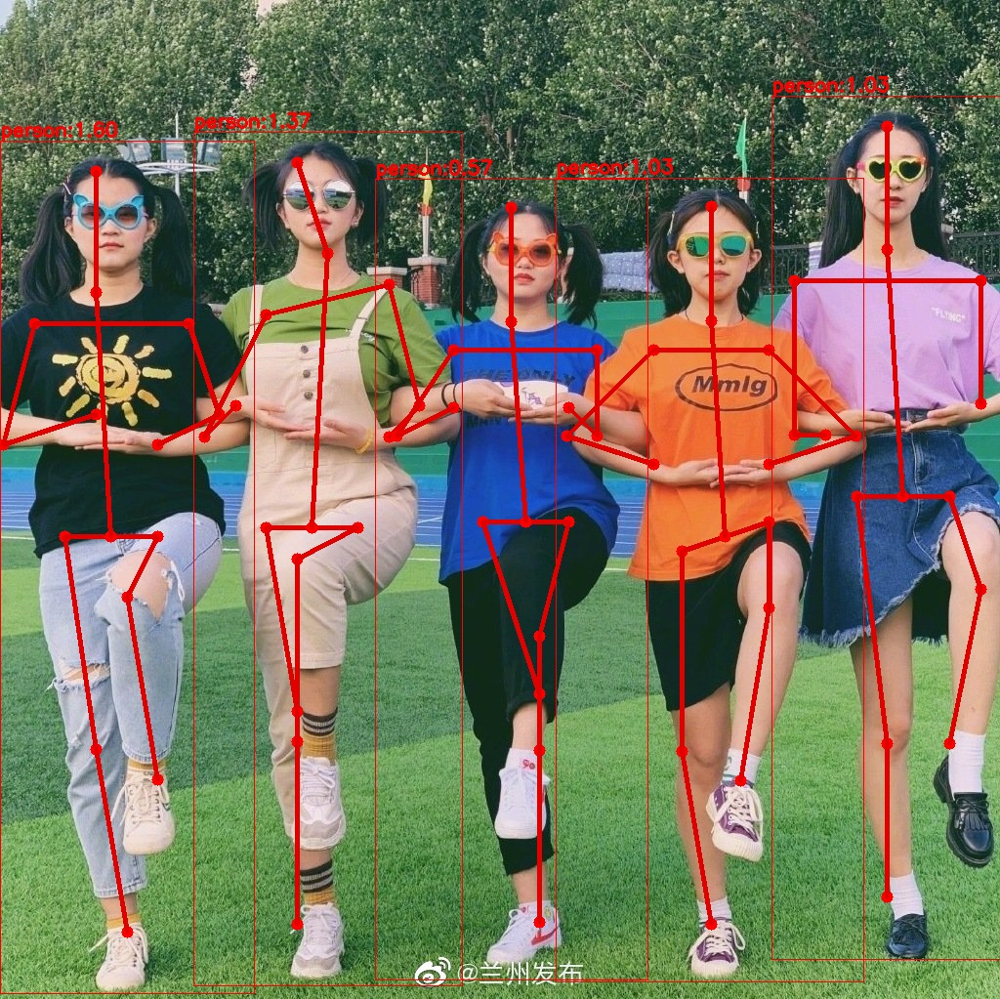
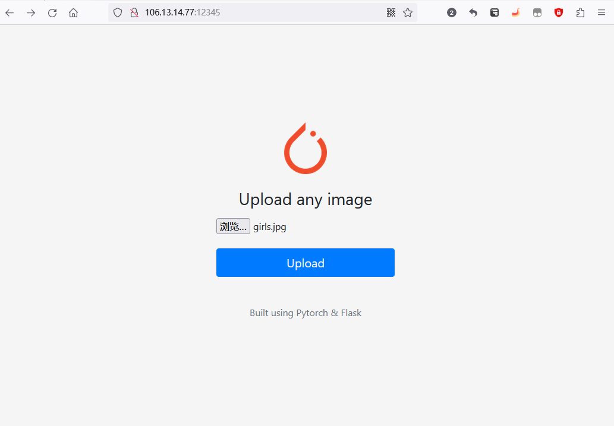
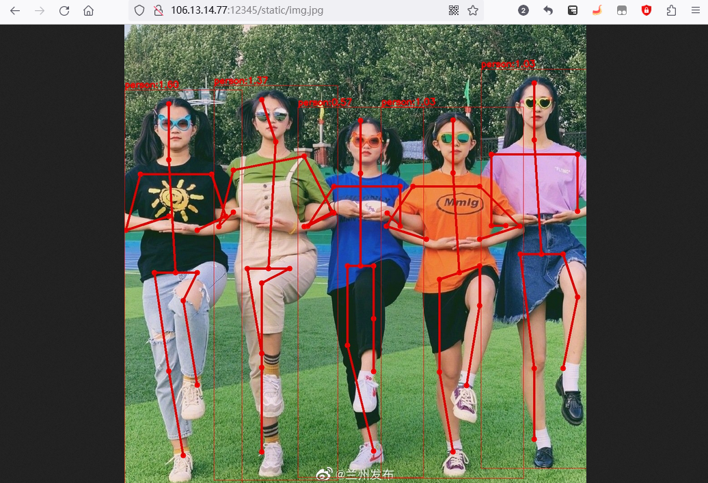

#### 2D Hand Pose Estimation 

#### 1. 编译相关依赖文件
* tflite
* opencv
* flatbuffers

#### 2. 人体检测模型
人体检测模型采用nanodetplus模型：输入图片格式为RGB, 模型输入大小[1, 288, 512, 3], 模型输出大小[1, 3064, 33]。

#### 3. 人体姿态模型
姿态的推理采用mobilenet v2模型：输入图片格式为BGR, 模型输入大小[1, 3, 224, 224], 模型的输出大小[1, 14, 28, 28]。

* 注意tflite进行推理时，先将图片的通道顺序NHWC更换为NCHW
* 模型出的14张heatmap图，最高响应的点对应的索引为关键点坐标

#### 4. 输出结果

|          原图           |            结果             |
|:---------------------:|:-------------------------:|
|  |  |

**后续计划**：            
第一阶段：      
* 日志打印预处理，推理，后处理耗时        
* 测试帧率       
* 模型并行推理              
                        

第二阶段：
* 封装Android接口         
* 添加GPU, DSP调用接口       
* 指令集优化，缓存优化        

第三阶段：
* 多硬件协同调度(CPU, GPU, DSP)
* 功耗测试

___

#### pybind11封装人体姿态估计功能

（1）`bind`文件夹用于生成人体姿态功能的`python`接口

```
cd bind
cmake -B build 
cmake --build build --parallel 12
```

（2）生成链接库`inference.cpython-310-x86_64-linux-gnu.so`在`build`文件夹下

（3）将链接库放在`infer.py`同一目录，当然也可以通过下面方式添加链接库

```
import sys
sys.path.append("/mnt/e/WorkSpace/CPlusPlus/2d_pose_estimation/bind/build/")
import inference
```

____

#### 将算法部署到服务器

（1）`server_deploy`文件夹用于部署算法到服务器

```
 nohup gunicorn app:app -c gunicorn.conf.py &
```

（2）通过`公网IP:12345`访问网页





(3) 如果直接通过`公网IP地址`访问该网页，进行如下设置：

```
#### nginx运行、停止、重启、查看状态
#sudo /etc/init.d/nginx start
#sudo /etc/init.d/nginx stop
#sudo /etc/init.d/nginx restart
#sudo /etc/init.d/nginx status
```

首先安装`sudo apt install nginx`,然后修改`nginx`的配置文件`vim /etc/nginx/sites-available/default`, 最后重启nginx即可。

```
server {
        listen 80 default_server;
        listen [::]:80 default_server;
        server_name localhost;

        location / {
                proxy_pass http://127.0.0.1:12345;
        }
```

其中server_name为域名，localhost代表通过ip访问，配置好Nginx后就可以启动了，可以通过`ps aux | grep nginx`查看nginx进程，然后在浏览器上输入http://ip看是否正常运行。
